# Hướng dẫn quản lý tour trên website Bắc Việt Travel

Dành cho nhân viên marketing. Bạn soạn, sửa và gửi duyệt tour. Chủ doanh nghiệp duyệt rồi tour mới hiện trên web.

**Điều cần nhớ:** khách chỉ thấy bản đã được duyệt. Bạn sửa thoải mái, lưu bao nhiêu lần cũng được, khách không thấy gì cho tới khi bản mới được duyệt.

---

## 1. Đăng nhập

1. Vào `https://<tên miền>/login`.
2. Nhập email công việc của bạn, bấm **Gửi liên kết đăng nhập**.
3. Mở email, bấm vào liên kết. Website không dùng mật khẩu.

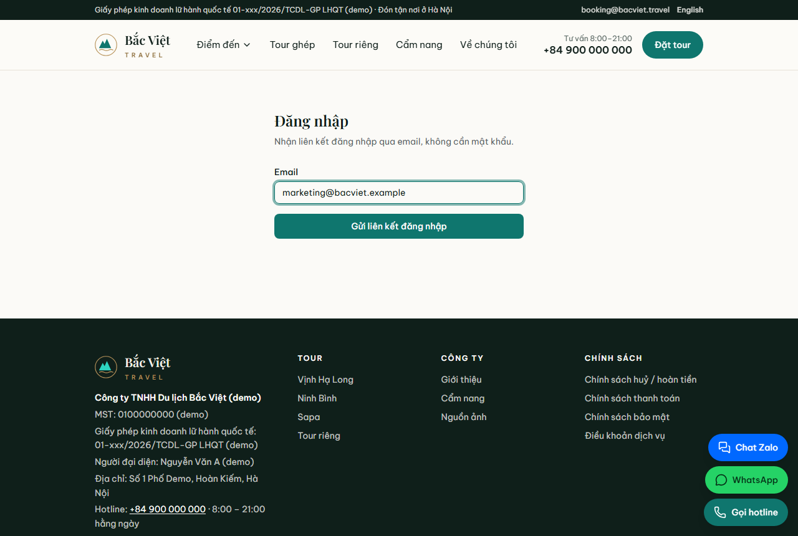

Sau khi đăng nhập, vào **`/admin/tours`**, hoặc bấm **Quản trị → Tour**.

> Không thấy trang này? Báo chủ doanh nghiệp cấp quyền "biên tập viên" cho email của bạn.

## 2. Danh sách tour

Mỗi dòng là một tour, gồm:
- **Trạng thái:** Nháp, Chờ duyệt, Đã duyệt (đang hẹn giờ) hoặc Đã công khai.
- **Trên web:** khách có đang thấy tour này không.
- **Còn thiếu:** số mục chưa điền. Phải đủ thì mới gửi duyệt được.

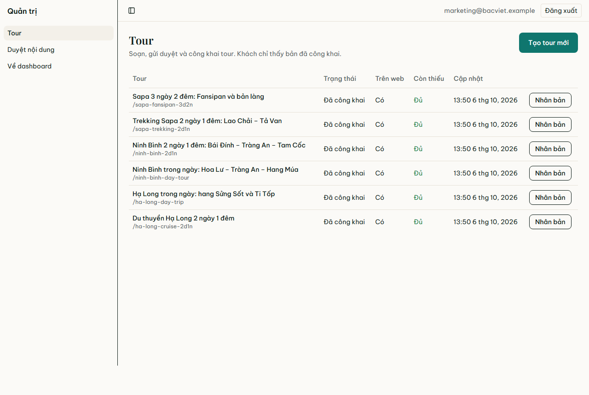

## 3. Tạo tour mới

Có hai cách.

**Cách nhanh, nên dùng: nhân bản một tour có sẵn.** Bấm **Nhân bản** ở tour giống nhất. Bạn được một bản sao đã đủ thông tin, chỉ cần sửa những chỗ khác.

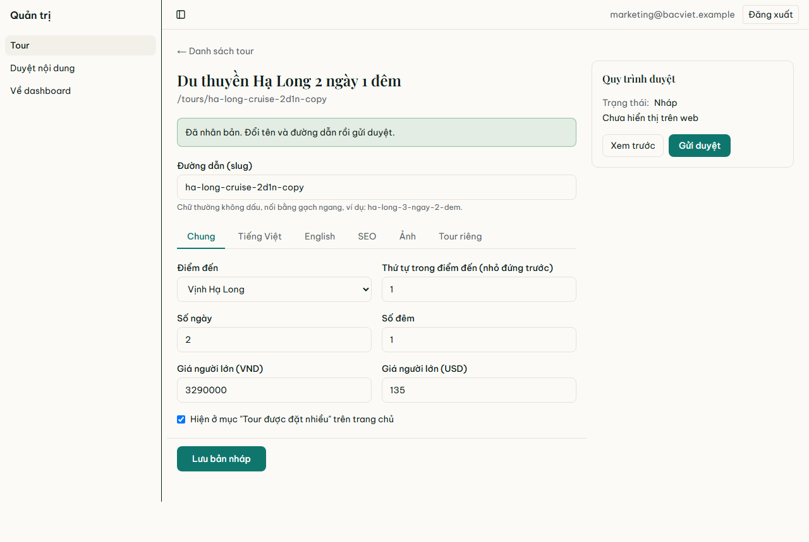

**Cách thứ hai: tạo từ đầu.** Bấm **Tạo tour mới**, nhập tên tour và đường dẫn, rồi bấm **Tạo bản nháp**.

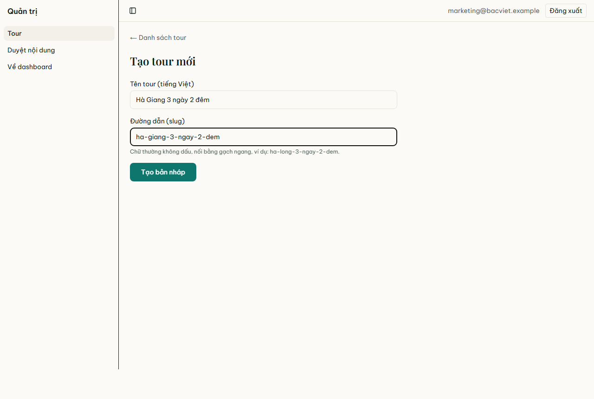

**Đường dẫn (slug)** là phần cuối của link tour, ví dụ `bacviet.travel/tours/ha-giang-3-ngay-2-dem`. Quy tắc:
- chữ thường, không dấu;
- các từ nối bằng gạch ngang;
- nên có điểm đến và số ngày.

## 4. Điền thông tin

Ô vàng **"Còn thiếu trước khi gửi duyệt"** liệt kê những mục chưa điền. Tab nào còn thiếu có **chấm vàng** cạnh tên.

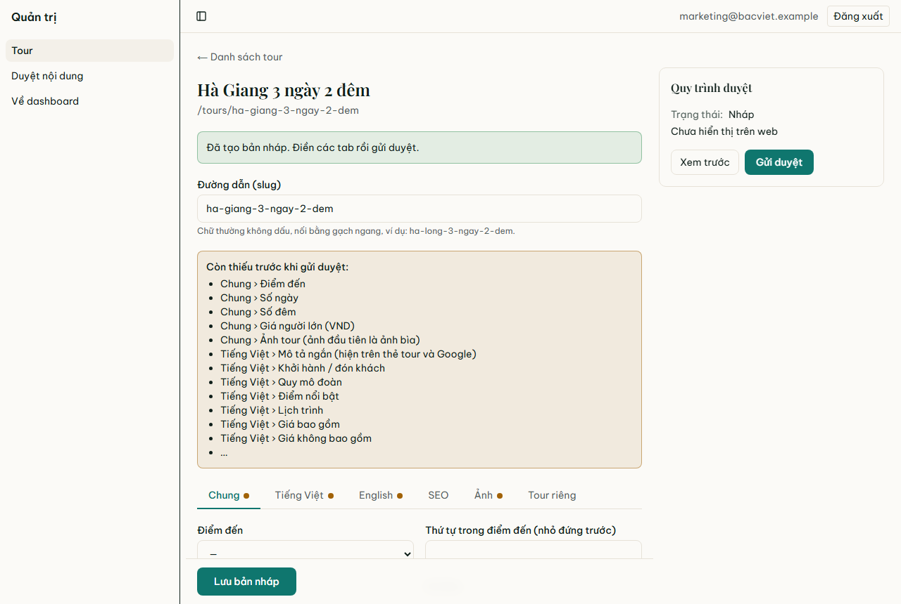

| Tab | Điền gì |
|---|---|
| **Chung** | Điểm đến, số ngày/đêm, giá người lớn (VND và USD), có hiện ở "Tour được đặt nhiều" trên trang chủ không |
| **Tiếng Việt** | Tên tour, mô tả ngắn, khởi hành/đón khách, quy mô đoàn, điểm nổi bật, lịch trình từng ngày, giá bao gồm / không bao gồm, giới thiệu |
| **English** | Như tab Tiếng Việt, bằng tiếng Anh cho khách nước ngoài |
| **SEO** | Tiêu đề và mô tả trên Google (không bắt buộc, xem mục 5) |
| **Ảnh** | Ảnh tour. **Ảnh đầu tiên là ảnh bìa** |
| **Tour riêng** | Bật nếu nhận tour riêng (xe riêng, hướng dẫn viên riêng, chọn ngày). Nhập số khách tối đa và giá mỗi người theo số khách |

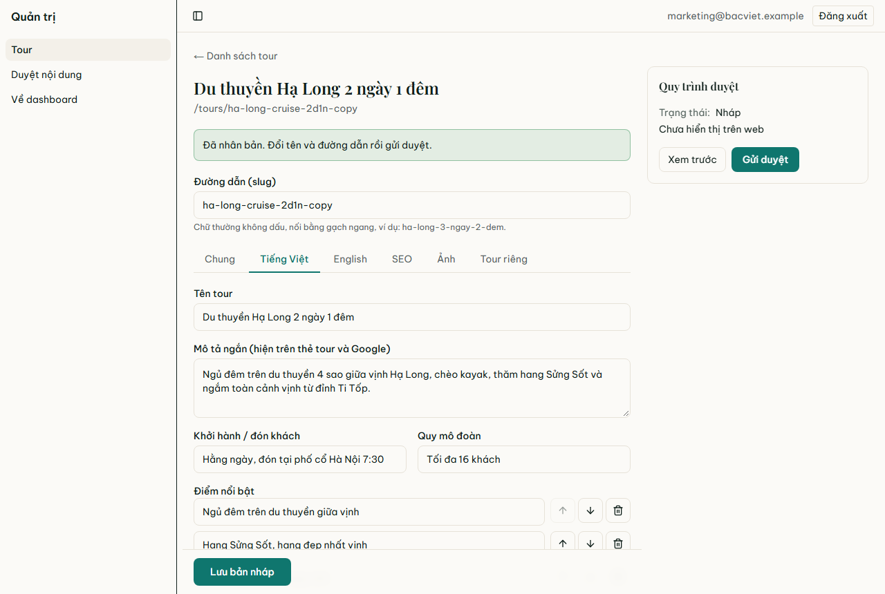

Các danh sách (điểm nổi bật, lịch trình, ảnh…) có nút **Thêm**, **Xoá**, **Lên**, **Xuống** để đổi thứ tự.

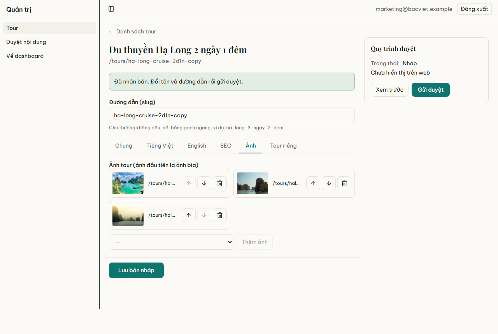

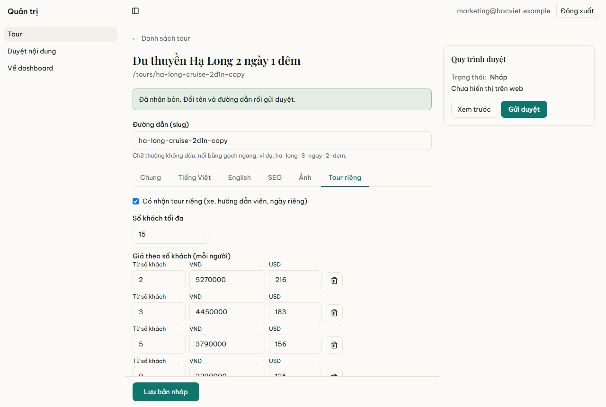

Mẹo cho phần **Giới thiệu**:
- `**chữ đậm**`;
- dòng bắt đầu bằng `- ` để tạo gạch đầu dòng;
- `<Callout>ghi chú</Callout>` để tạo khung ghi chú nổi bật.

**Nhớ bấm "Lưu bản nháp"** (nút xanh dưới cùng) trước khi rời trang. Thiếu thông tin vẫn lưu được.

## 5. SEO: tiêu đề và mô tả trên Google

Không bắt buộc. Để trống thì Google dùng tên tour và mô tả ngắn. Nên điền khi muốn câu chữ hấp dẫn hơn trên trang kết quả tìm kiếm:
- **Tiêu đề:** dưới 60 ký tự, có điểm đến và số ngày.
- **Mô tả:** 120–155 ký tự, nêu điểm hấp dẫn nhất và giá hoặc lợi ích chính.

Ô xám bên dưới cho thấy kết quả sẽ hiện trên Google (ước lượng).

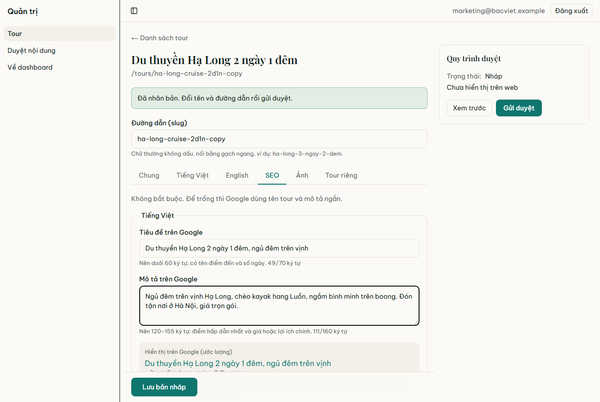

## 6. Xem trước

Bấm **Xem trước** trong khung **Quy trình duyệt** bên phải. Trang tour mở ra đúng như khách sẽ thấy, với dải vàng *"Đang xem trước bản nháp (khách không thấy)"*.
- Chỉ bạn thấy bản này; khách vẫn thấy bản cũ.
- Trên bản xem trước, nút đặt tour và form hỏi tour bị tắt.
- Xem xong, bấm **Thoát xem trước** trên dải vàng.

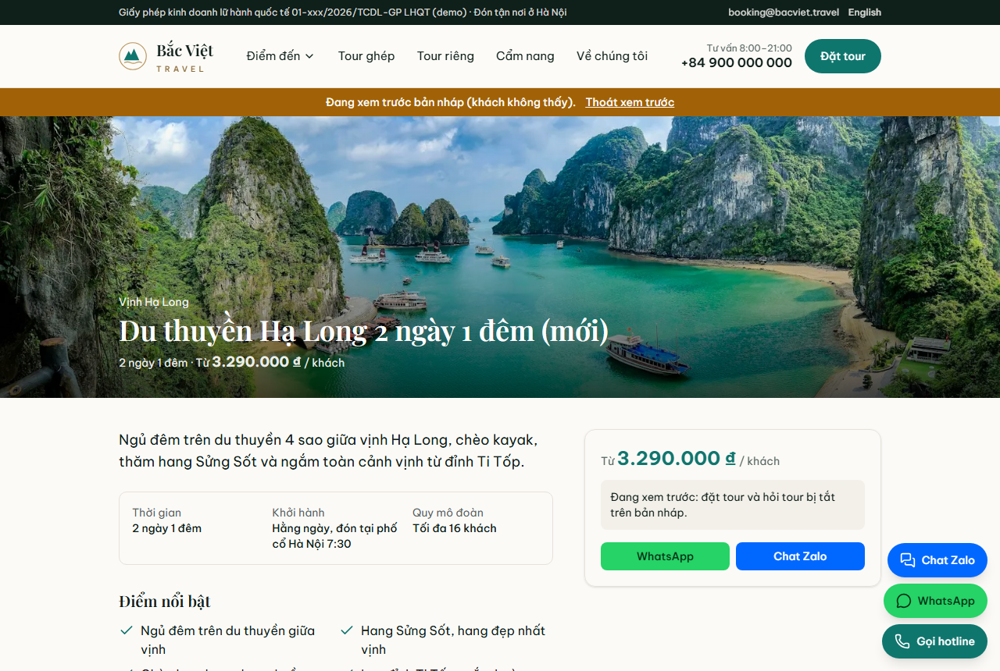

## 7. Gửi duyệt

Khi danh sách "còn thiếu" đã hết, bấm **Gửi duyệt**. Trạng thái chuyển thành **Chờ duyệt** và chủ doanh nghiệp nhận được email.

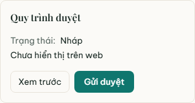

Chủ doanh nghiệp có thể:
- **Duyệt và công khai ngay:** tour hiện trên web trong vòng khoảng một phút.
- **Duyệt và hẹn giờ:** tour tự hiện vào thời điểm đã chọn.
- **Trả lại để sửa** kèm ghi chú.

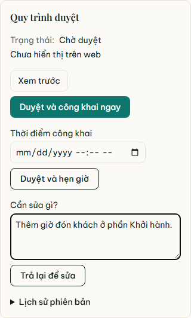

Nếu bị trả lại, bạn nhận email. Ghi chú hiện trong khung quy trình duyệt. Sửa theo ghi chú, lưu, rồi gửi duyệt lại.

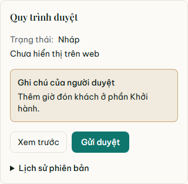

## 8. Sửa một tour đang hiện trên web

Mở tour, sửa, lưu rồi gửi duyệt như bình thường. **Khách vẫn thấy bản cũ cho tới khi bản mới được duyệt.**

**Đổi đường dẫn** của tour đang hiện trên web cũng được. Sau khi bản mới được duyệt:
- link cũ tự chuyển sang link mới;
- link đã chia sẻ trên Facebook/Zalo vẫn dùng được;
- thứ hạng Google không mất.

## 9. Lịch sử phiên bản

Trong khung quy trình duyệt, mở **Lịch sử phiên bản** để xem các lần gửi duyệt và công khai.
- Bấm **Khôi phục** để chép một phiên bản cũ vào bản nháp.
- Bản đang hiện trên web không đổi cho tới khi bản khôi phục được duyệt.

## Câu hỏi thường gặp

**Tôi lưu rồi mà web không đổi?**
Đúng như thiết kế. Bản lưu là bản nháp; cần được duyệt thì khách mới thấy.

**Nút "Gửi duyệt" báo chưa đủ thông tin?**
Xem ô vàng "Còn thiếu" và các tab có chấm vàng. Điền đủ, lưu, rồi gửi lại.

**Báo "Nội dung vừa được người khác thay đổi"?**
Có người khác vừa lưu tour này. Tải lại trang để lấy bản mới nhất rồi sửa tiếp.

**Báo "Đường dẫn này đã có tour khác dùng"?**
Chọn đường dẫn khác, ví dụ thêm số ngày hoặc từ "rieng".

**Tôi không thấy mục Đơn đặt tour hay thanh toán?**
Đúng như thiết kế. Tài khoản marketing chỉ quản lý nội dung.

---

Ảnh chụp tạo bằng `pnpm build && pnpm guide:screens`. Chạy lại khi giao diện thay đổi.
